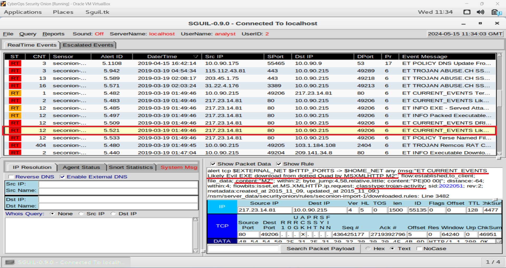

# Analyzing Alerts with ELK Stack  

This project showcases the use of the Elastic Stack (ELK Stack) tools for verifying alert, analyzing logs and
investigating security events.  

In this activity, a scenario prompt was provided with some questions to be answered by analysing the data. The resources
used for this showcase, which include the prompt, questions, and data logs, were taken from the
[Cisco's CyberOps][link1] course provided by *Cisco's* and *NetaCad's* team. **The analysis and responses for the questions
are original and done by the owner of this repository.**  

The resources used during this analysis are:  

- [Security Onion (OS)][link2]
- [Sguil][link3]
- [Wireshark][link8]
- [Elastic Stack (*ELK Stack*)][link4]

---

# Index  

1. [Prompt][link5]
2. [Questions and Responses][link6]
3. [Analysis][link7]

---

# Prompt  

A computer got infected in March 2019. Network security tools generated alerts regarding this infection. A deep analysis
need to be performed to determine some details about this security incident.  

First, some details are provided about the incident:    

- The infection occurred within a Windows machine;  
- The infected machine was working within an *Active Directory* (AC) environment;  
- The incident occurred in March 2019 date range.  

---

# Questions and Answers  

The analysis will answer some questions about the security incident. These questions are essential part of the
investigation and will help to understand the scope of the problem.  

These are the questions:  

1. **What was the specific time of the attack in 2019-03-19?**  
2. **Which Windows host computer was infected?**  
3. **What was the computer infected with?**  

For the purpose of clarity, the answers will be provided here and further explained, as well as deeply analyzed, in the
[Analysis][link7] segment of this report.  

The answers for the previous questions are:  

1. What was the specific time of the attack in 2019-03-19? => **Started at 01:45 am and ended at 04:54 am.**  
2. Which Windows host computer was infected? => **Hostname: BOB-TIGER-PC, Host Domain: littletigers.info.**  
3. What was the computer infected with? => **VBKryjector (Trojan)** and **Dridex (Info-stealer)**.  

---

# Analysis  

## Alerts  

The first step for the analysis will focus on verifying alerts. [Sguil][link3] tool will be the starting point, from
there the research will be pivoted to other tools and areas for further inspection.  

   

The main alerts for the scope of this investigation are highlighted within the red rectangle.  

They will be investigated from bottom to top, since this is the order which the timestamps are listed.  

  

The first alert is highlighted, some details need to be made clear:  

1. The alert has **5.439** as the **Alert ID**. This alert also has **DPort** (*Destination Port*) **53** which is a
common port associated with **DNS** protocol.  
2. This tab shows more details regarding the selected alert. It is possible to see that this alert was generated due to
the infringement of a rule regarding DNS.  

This rule prohibits any **External** IP address going to the **Internal** IP address on port **53** (*DNS protocol*).
Since the IP address **10.0.90.215** made a DNS query to the internal address **10.0.90.9**, a **policy violation**
alert was created.  

  

Analyzing traffic generated by the alert, the previous assessed information can be verified:  

1. The **source address** is **10.0.90.215**, which is an external address, queried the **10.0.90.9** **destination
address** on port **53** (*DNS protocol*).  
2. Analysing the data within the **application layer** (*using the TCP/IP model as a reference*), the DNS information
shows that it was **DNS Update** for the source address.  
3. Here it's possible to see the verification of one of the answers: *Which Windows host computer was infected?* => 
**Bobby-Tiger-PC** at the address **10.0.90.215**.  

All the other alerts involve this IP address. Therefore, it's possible to affirm this is the address of the infected 
host computer.  

Continuing the investigation by moving to different alerts.  

  

The highlighted alerts are going to be assessed as a single one. That is because this set of alerts have the same
**SCR IP** (*IP Source Address*) and **DST IP** (*IP Destination Address*), they also make use of equal **SPort**
(*Source Port*) and **DPort** (*Destination Port*).  

  

Details about the **Event 1**:  

- This alert was generated due to a **policy violation**, which can be seen within the details of the alert next to the
**classtype** info;
- The rule that triggered the alert detected a **Windows Executable file** within the transmitted data. This can also be
verified in the **msg** info section and **content** section as well.  

  

In **Event 2**, the alert was triggered for a similar reason as in **Event 1**. The rule identified a suspicious file
within the transmitted data which contained the *MZ* characters, this information will be further explained along the
analysis.  

  

**Event 3** has similar triggers as the previous ones. The new flag for malicious activity is contained in the
**classtype** section, which identified the same *.exe* file, but it flagged as **trojan-activity**.  

  

**Event 4** has all the previous indicators, such as the **MZ** characters in the transmitted data and the flag of
**trojan-activity** in the alert's details.  

  

All the previous events have the same transcripts of the network traffic which present the following **IoCs**
(*Indicators of Compromise*).  

1. The **Source IP Address**, which is the address of the Windows Host;  
2. **Destination IP Address**, this is the address of the server that is hosting the downloaded file;  
3. Here it's **HTTP GET** performed by the source IP address. In fact, the file requested was a Windows executable named
**"test1.exe"**;  
4. Other important details, which can be further used as evidence for the investigation, are the information about the
server that is hosting this payload. The server is running in an instance of **CentOS** (a unix based OS) and making use
of **Apache** version 2.4.6;  
5. Even though the HTTP GET requested a specific *.exe* file, this item confirms that this transmission contains a
Windows Executable.  

When analyzing the metadata, a Windows Executable file starts with the **MZ** characters. EXE files also have the
string: "*This file cannot be run in DOS mode*".  

Other events present the exact same information as previously seen transcript. They are the following:  

  

Those events share the same information as the previous ones. The same **IP source** and **destination addresses** and
**source** and **destination ports**.  

  

Just as the previous events, **Event 5** shows, in the details section, that the rules identified the *.exe* file, which
can be verified next to the **content** info.  

  

Still in the details of **Event 5**, the **classtype** was flagged as a **trojan-activity**. The transmission was also
labeled as a "**malware family MalDocGeneric**", which is the rule's way of saying that this file is associated with
malware activity.  

  

**Event 6** presents the same previously seen flags and labels.  

  

Just as the previous network traffic transcript, **Events 5** and **6** display the same information. The most important
ones are:  

1. The same **destination address**, which points to the server hosting the "**test1.exe**" file;  
2. The same information about the hosting server. The same **OS** and **web server** software;  
3. Just as the previous traffic, the data contains the same indicators of the Windows Executable file.  

An executable file being downloaded over the internet is not something unusual. Even though this action can violate
company's policies, the download of a file by itself does not classify as malicious event.  

In order to classify this as a malicious event, further investigation needs to be conducted on the downloaded file.  

  

Pivoting to the traffic analysis tool [Wireshark][link8], an object could be extracted from the traffic which is the
file contained in the alerts: "**test1.exe**".  

  

By extracting the file from the previously seen pcap, some information can be determined about the file:  

1. The file is in fact a Windows executable;  
2. The SHA256 hash of the file, which is the fingerprint of this executable.  

The SHA256 hash is going to be used to further investigate the origin and intentions of this file.  

The first resource that is going to be used to investigate the file's origin is [VirusTotal][link9]. A resource which
provide information about known malicious files, websites, domains, IPs, etc.  

  

Searching the file's hash in VirusTotal, the website returns many different indications that this file is malign in
origin. Some of those indications are listed as follows:  

1. File's hash => **2a9b0ed40f1f0bc0c13ff35d304689e9cadd633781cbcad1c2d2b92ced3f1c85**;  
2. Most common name for the file => **WEXTRACT.EXE**;  
3. The labels assigned to this file by the different vendors => **VBKryjector**;   
4. The category of the file => **Trojan**;  
5. Family which the file is associated => **VBKryjector**;  
6. Different labels set by the vendors.  

After assessing that the downloaded file it's in fact malicious in nature, a simple Google search yields more
information about this virus.  

  

According to an article from [FortiGuard][link10], the virus is a **Trojan** malware, which can be used for many
different purposes, such as stealing user's information, downloading or uploading data/files from or to a server on the
internet, or even be used as an agent in a botnet.  

Now that the infection was identified and verified, it's time to proceed with analysing the alerts.  

  

The following alert goes to a different address than the previous ones, so this alert is treated as a completely
different event.  

Some information are highlighted in the detail's alerts:  

- The **msg** info labeled this alert as a "**Trojan REMCOM/RAT**" type of activity;  
- The **content** segment lists some hexadecimal values which was detected as a signature for malicious activities;  
- **Metadata** info of the rule also categorized as a **Trojan** activity;  
- Ensuring that this alert was generated due to a malicious activity on the network, the **classtype** information was
also flagged as **trojan-activity**.  

Since the previous infection was assessed as a **trojan** type of malware, now this alert, which was time-wise very
close to the ones before, is categorized as a trojan type of activity. It's possible that they might be correlated.    

In order to make sure those alerts have some correlation, it's important to analyse the traffic of this data.  

  

Some important details are highlighted in the picture:  

1. The **Destination IP address**, which is the same one contained in the alert;  
2. The **Destination Port**, which is important due to the fact that it is not associated with any known protocols or
applications for web communication;  
3. The actual data that was being transmitted, which seems to be encoded.  

Those transmissions look a lot like **C2** (*Command and Control*) type of traffic. The reason being that usually the
**source** address (*the **blue** highlighted data*) doesn't send so much information to the **destination** address
(*the **red** highlighted data*).  

Another indication that this might be **C2** related traffic is the constant exchange of information going out of the
host and coming into it. In healthy traffic exchanges, the host might request a webpage or a file from a server, and the
server will be the one in charge of handling the heavy data.  

Commonly, the host might just acknowledge the reception of data but itself won't be the one sending data back to the
server. The repeated two-way communication that was happening, it's frequently associated with a **remote shell**
environment type of traffic. That would explain the **REMCOM/RAT** flag which was set by the alert.   

One more indication that this is malicious traffic is the **destination port** used for this exchange. In normal
communication, the host would reach out to a server through a known port, frequently associated with a service/protocol
for data transfer (e.g. DNS: port53, HTTP: port 80 or HTTPS: port 443). This traffic is using an unusual destination
port.  

The use of encoded data is another aspect that should be mentioned, since secure protocol will make use of
**encryption**, which is harder to crack and generate garbage data. In this transmission, it's possible to identify
certain repeated pattern with slight modifications line after line. If encryption was being used, this repetition of
patterns wouldn't occur.  

Due to the short time spam between initial infection and this suspicious transmission of data, considering all the
indications of this being *C2* traffic as well, it's possible to assume those malicious events are related to each
other.  

Proceeding with the investigation, a new set of alerts were generated.  

  

Similarly to the previous alerts, these will be categorized as belonging to the same event due to the recurrence
of information, such as the same **SRC IP** (*Source IP*), **DST IP** (*Destination IP*), **SPort** (*Source Port*), and
**DPort** (*Destination Port*).  

  

The details to be noticed are:  

- The **msg** info generated by the rule, detected a "*hostile exe file*";  
- The **content** info confirms the presence of a Windows Executable file contained in the transmitted data;  
- The **classtype** flagged this as a type of **trojan-activity**.  

  

---

[link1]: https://www.netacad.com/courses/cybersecurity/cyberops-associate
[link2]: https://securityonionsolutions.com/
[link3]: https://bammv.github.io/sguil/index.html
[link4]: https://www.elastic.co/elastic-stack
[link5]: https://github.com/ItaloHugoMDS/Analyzing_Alerts_with_ELK_Stack#prompt
[link6]: https://github.com/ItaloHugoMDS/Analyzing_Alerts_with_ELK_Stack#questions-and-answers
[link7]: https://github.com/ItaloHugoMDS/Analyzing_Alerts_with_ELK_Stack#analysis
[link8]: https://www.wireshark.org/
[link9]: https://www.virustotal.com/
[link10]: https://fortiguard.fortinet.com/encyclopedia/virus/8078615
