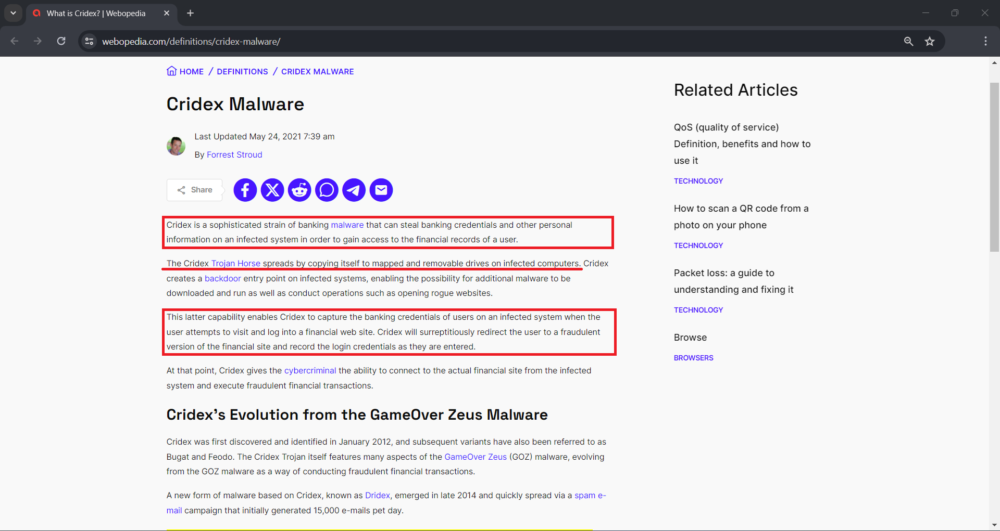

# Analyzing Alerts with ELK Stack  

This project showcases the use of the Elastic Stack (ELK Stack) tools for verifying alert, analyzing logs and
investigating security events.  

In this activity, a scenario prompt was provided with some questions to be answered by analysing the data. The resources
used for this showcase, which include the prompt, questions, and data logs, were taken from the
[Cisco's CyberOps][link1] course provided by *Cisco's* and *NetaCad's* team. **The analysis and responses for the questions
are original and done by the owner of this repository.**  

The resources used during this analysis are:  

- [Security Onion (OS)][link2]
- [Sguil][link3]
- [Wireshark][link8]
- [Elastic Stack (*ELK Stack*)][link4]

---

# Index  

1. [Prompt][link5]
2. [Questions and Responses][link6]
3. [Analysis][link7]

---

# Prompt  

A computer got infected in March 2019. Network security tools generated alerts regarding this infection. A deep analysis
need to be performed to determine some details about this security incident.  

First, some details are provided about the incident:    

- The infection occurred within a Windows machine;  
- The infected machine was working within an *Active Directory* (AC) environment;  
- The incident occurred in March 2019 date range.  

---

# Questions and Answers  

The analysis will answer some questions about the security incident. These questions are essential part of the
investigation and will help to understand the scope of the problem.  

These are the questions:  

1. **What was the specific time of the attack in 2019-03-19?**  
2. **Which Windows host computer was infected?**  
3. **What was the computer infected with?**  

For the purpose of clarity, the answers will be provided here and further explained, as well as deeply analyzed, in the
[Analysis][link7] segment of this report.  

The answers for the previous questions are:  

1. What was the specific time of the attack in 2019-03-19? => **Started at 01:45 am and ended at 04:54 am.**  
2. Which Windows host computer was infected? => **Hostname: BOB-TIGER-PC, Host Domain: littletigers.info.**  
3. What was the computer infected with? => **VBKryjector (Trojan)** and **Cridex (Info-stealer)**.  

---

# Analysis  

## Alerts  

The first step for the analysis will focus on verifying alerts. [Sguil][link3] tool will be the starting point, from
there the research will be pivoted to other tools and areas for further inspection.  

   

The main alerts for the scope of this investigation are highlighted within the red rectangle.  

They will be investigated from bottom to top, since this is the order which the timestamps are listed.  

  

The first alert is highlighted, some details need to be made clear:  

1. The alert has **5.439** as the **Alert ID**. This alert also has **DPort** (*Destination Port*) **53** which is a
common port associated with **DNS** protocol.  
2. This tab shows more details regarding the selected alert. It is possible to see that this alert was generated due to
the infringement of a rule regarding DNS.  

This rule prohibits any **External** IP address going to the **Internal** IP address on port **53** (*DNS protocol*).
Since the IP address **10.0.90.215** made a DNS query to the internal address **10.0.90.9**, a **policy violation**
alert was created.  

  

Analyzing traffic generated by the alert, the previous assessed information can be verified:  

1. The **source address** is **10.0.90.215**, which is an external address, queried the **10.0.90.9** **destination
address** on port **53** (*DNS protocol*).  
2. Analysing the data within the **application layer** (*using the TCP/IP model as a reference*), the DNS information
shows that it was **DNS Update** for the source address.  
3. Here it's possible to see the verification of one of the answers: *Which Windows host computer was infected?* => 
**Bobby-Tiger-PC** at the address **10.0.90.215**.  

All the other alerts involve this IP address. Therefore, it's possible to affirm this is the address of the infected 
host computer.  

Continuing the investigation by moving to different alerts.  

  

The highlighted alerts are going to be assessed as a single one. That is because this set of alerts have the same
**SCR IP** (*IP Source Address*) and **DST IP** (*IP Destination Address*), they also make use of equal **SPort**
(*Source Port*) and **DPort** (*Destination Port*).  

  

Details about the **Event 1**:  

- This alert was generated due to a **policy violation**, which can be seen within the details of the alert next to the
**classtype** info;
- The rule that triggered the alert detected a **Windows Executable file** within the transmitted data. This can also be
verified in the **msg** info section and **content** section as well.  

  

In **Event 2**, the alert was triggered for a similar reason as in **Event 1**. The rule identified a suspicious file
within the transmitted data which contained the *MZ* characters, this information will be further explained along the
analysis.  

  

**Event 3** has similar triggers as the previous ones. The new flag for malicious activity is contained in the
**classtype** section, which identified the same *.exe* file, but it flagged as **trojan-activity**.  

  

**Event 4** has all the previous indicators, such as the **MZ** characters in the transmitted data and the flag of
**trojan-activity** in the alert's details.  

  

All the previous events have the same transcripts of the network traffic which present the following **IoCs**
(*Indicators of Compromise*).  

1. The **Source IP Address**, which is the address of the Windows Host;  
2. **Destination IP Address**, this is the address of the server that is hosting the downloaded file;  
3. Here it's **HTTP GET** performed by the source IP address. In fact, the file requested was a Windows executable named
**"test1.exe"**;  
4. Other important details, which can be further used as evidence for the investigation, are the information about the
server that is hosting this payload. The server is running in an instance of **CentOS** (a unix based OS) and making use
of **Apache** version 2.4.6;  
5. Even though the HTTP GET requested a specific *.exe* file, this item confirms that this transmission contains a
Windows Executable.  

When analyzing the metadata, a Windows Executable file starts with the **MZ** characters. EXE files also have the
string: "*This file cannot be run in DOS mode*".  

Other events present the exact same information as previously seen transcript. They are the following:  

  

Those events share the same information as the previous ones. The same **IP source** and **destination addresses** and
**source** and **destination ports**.  

  

Just as the previous events, **Event 5** shows, in the details section, that the rules identified the *.exe* file, which
can be verified next to the **content** info.  

  

Still in the details of **Event 5**, the **classtype** was flagged as a **trojan-activity**. The transmission was also
labeled as a "**malware family MalDocGeneric**", which is the rule's way of saying that this file is associated with
malware activity.  

  

**Event 6** presents the same previously seen flags and labels.  

  

Just as the previous network traffic transcript, **Events 5** and **6** display the same information. The most important
ones are:  

1. The same **destination address**, which points to the server hosting the "**test1.exe**" file;  
2. The same information about the hosting server. The same **OS** and **web server** software;  
3. Just as the previous traffic, the data contains the same indicators of the Windows Executable file.  

An executable file being downloaded over the internet is not something unusual. Even though this action can violate
company's policies, the download of a file by itself does not classify as malicious event.  

In order to classify this as a malicious event, further investigation needs to be conducted on the downloaded file.  

  

Pivoting to the traffic analysis tool [Wireshark][link8], an object could be extracted from the traffic which is the
file contained in the alerts: "**test1.exe**".  

  

By extracting the file from the previously seen pcap, some information can be determined about the file:  

1. The file is in fact a Windows executable;  
2. The SHA256 hash of the file, which is the fingerprint of this executable.  

The SHA256 hash is going to be used to further investigate the origin and intentions of this file.  

The first resource that is going to be used to investigate the file's origin is [VirusTotal][link9]. A resource which
provide information about known malicious files, websites, domains, IPs, etc.  

  

Searching the file's hash in VirusTotal, the website returns many different indications that this file is malign in
origin. Some of those indications are listed as follows:  

1. File's hash => **2a9b0ed40f1f0bc0c13ff35d304689e9cadd633781cbcad1c2d2b92ced3f1c85**;  
2. Most common name for the file => **WEXTRACT.EXE**;  
3. The labels assigned to this file by the different vendors => **VBKryjector**;   
4. The category of the file => **Trojan**;  
5. Family which the file is associated => **VBKryjector**;  
6. Different labels set by the vendors.  

After assessing that the downloaded file it's in fact malicious in nature, a simple Google search yields more
information about this virus.  

  

According to an article from [FortiGuard][link10], the virus is a **Trojan** malware, which can be used for many
different purposes, such as stealing user's information, downloading or uploading data/files from or to a server on the
internet, or even be used as an agent in a botnet.  

Now that the infection was identified and verified, it's time to proceed with analysing the alerts.  

  

The following alert goes to a different address than the previous ones, so this alert is treated as a completely
different event.  

Some information are highlighted in the detail's alerts:  

- The **msg** info labeled this alert as a "**Trojan REMCOM/RAT**" type of activity;  
- The **content** segment lists some hexadecimal values which was detected as a signature for malicious activities;  
- **Metadata** info of the rule also categorized as a **Trojan** activity;  
- Ensuring that this alert was generated due to a malicious activity on the network, the **classtype** information was
also flagged as **trojan-activity**.  

Since the previous infection was assessed as a **trojan** type of malware, now this alert, which was time-wise very
close to the ones before, is categorized as a trojan type of activity. It's possible that they might be correlated.    

In order to make sure those alerts have some correlation, it's important to analyse the traffic of this data.  

  

Some important details are highlighted in the picture:  

1. The **Destination IP address**, which is the same one contained in the alert;  
2. The **Destination Port**, which is important due to the fact that it is not associated with any known protocols or
applications for web communication;  
3. The actual data that was being transmitted, which seems to be encoded.  

Those transmissions look a lot like **C2** (*Command and Control*) type of traffic. The reason being that usually the
**source** address (*the **blue** highlighted data*) doesn't send so much information to the **destination** address
(*the **red** highlighted data*).  

Another indication that this might be **C2** related traffic is the constant exchange of information going out of the
host and coming into it. In healthy traffic exchanges, the host might request a webpage or a file from a server, and the
server will be the one in charge of handling the heavy data.  

Commonly, the host might just acknowledge the reception of data but itself won't be the one sending data back to the
server. The repeated two-way communication that was happening, it's frequently associated with a **remote shell**
environment type of traffic. That would explain the **REMCOM/RAT** flag which was set by the alert.   

One more indication that this is malicious traffic is the **destination port** used for this exchange. In normal
communication, the host would reach out to a server through a known port, frequently associated with a service/protocol
for data transfer (e.g. DNS: port53, HTTP: port 80 or HTTPS: port 443). This traffic is using an unusual destination
port.  

The use of encoded data is another aspect that should be mentioned, since secure protocol will make use of
**encryption**, which is harder to crack and generate garbage data. In this transmission, it's possible to identify
certain repeated pattern with slight modifications line after line. If encryption was being used, this repetition of
patterns wouldn't occur.  

Due to the short time spam between initial infection and this suspicious transmission of data, considering all the
indications of this being *C2* traffic as well, it's possible to assume those malicious events are related to each
other.  

Proceeding with the investigation, a new set of alerts were generated.  

  

Similarly to the previous alerts, these will be categorized as belonging to the same event due to the recurrence
of information, such as the same **SRC IP** (*Source IP*), **DST IP** (*Destination IP*), **SPort** (*Source Port*), and
**DPort** (*Destination Port*).  

  

The details to be noticed are:  

- The **msg** info generated by the rule, detected a "*hostile exe file*";  
- The **content** info confirms the presence of a Windows Executable file contained in the transmitted data;  
- The **classtype** flagged this as a type of **trojan-activity**.  

  

This event appears to be very similar as the previous one. The ".exe" file was also detected with the same
**classtype**. The only new detail is the **content** information, which detected the "**MZ**" characters contained in
every Windows executable.  

  

This alert presents the same flags and the previously discussed event.  

  

New information comes up in this event. However, the indications are the same, pointing to the executable file.  

  

  

  

The three last events have the similar flags, but they all point to the same problem: **a strange Windows executable
file being downloaded from an unauthorized server over an unencrypted connection.**  

As previously mentioned, an executable file being downloaded is not an uncommon behaviour, although it may violate
the company's police.  

Further investigation needs to be performed to verify the trustworthiness of this executable.  

  

The first step is to analyze the data traffic of the connection. Some details need to be pointed out:  

1. The IP address that is present in all the previous seen alerts;  
2. The HTTP GET which requested a file name "**f4.exe**", in fact a Windows executable;  
3. The server-side confirmation of the ".exe" file;  
4. Signature contained in all Windows executable files.  

In conclusion, the alerts positively detected the executable file, which was confirmed by investigation the data traffic
of the conversation.  

Now, it's time to analyse the downloaded file itself to evaluate if it is malicious in nature.  

  

Wireshark's traffic contains all the data necessary to be able to extract the raw file.  

By extracting the file, other information can be taken from it:  

1. Confirming it's in fact a Windows executable;  
2. The SHA256 hash, which will be used for further analysis.  

Since a hash was created, the next step is pivoting to [VirusTotal][link9] to verify if this file is associated with
malicious activities.  

  

VirusTotal yielded some results from different vendors, details to be pointed are:  

1. File's hash => **5865e801e6324166d6d05b39a14f2a8a798c6eb652831f78c2634f2b7a400eaf**;  
2. Most common name for the file => **win32uiole.pyd**;  
3. The labels commonly assigned to the file => **Cridex**;  
4. The category assigned to the file => **Trojan**;  
5. Family labels associated to the file => **Cridex**;  
6. File evaluation done by multiple vendors.  

The search confirmed that the executable it's malicious in nature and has obscure intentions. It was identified as a
variation of the **Cridex** malware.  

A simple Google search returns more information about this family of malware.  

  

The **Cridex** malware family has many variations. However, the original branch of the malware was an **info-stealer**
focused on stealing **banking** credentials, as showed in the article from Forrest Stroud on [Webopedia][link11].  

Even though the malware has info-stealing capabilities, it was designed as a **trojan** type of malware. Its spreading
mechanism assimilates to a worm-like kind of infection "copying itself to mapped and removable drives", as stated in the
article.  

Now that the infection was assessed and identified, it's time to proceed with the alerts.  

  

The alert in question comes with many different flags and indications of malicious activity. Some of those are:  

- The **SPort** (*Source Port*) is coming from an unusual port number, which is not associated with any known
applications;  
- The alert's **msg** flagged this behaviour associated with a **Dridex** malware, which is a variation of the
**Cridex** malware previously assessed;  
- The **reference** segment, displayed information related to the abuse of an SSL Certificate, important detail that
will be considered for further analysis;  
- The **classtype** info shows this alert is associated with **trojan-activity**;  
- Lastly, amongst other information generated by the alert, a tag points to a malicious SSL Certificate.  

Malicious SSL Certificates are forged certificates used to encrypt malicious traffic. Since only trusted Certificate
Issuing Companies are allowed to sign SSL Certificates, malicious actors forge fake certificates signed by non-reliable
or even non-existing companies in order to hide malicious data traffic.  

The alert has also identified that this type of traffic is associated with a variation of the **Cridex** malware:
**Dridex**. This is important information to correlate both events.  

  

The first step of the investigation on this alert is to look at the transcript of the traffic, some important details
come up when doing that:  

1. The IP address involved in the alert;  
2. The unusual destination port;  
3. Details about the data traffic;  
4. Most importantly, information which seems to be related to the SSL Certificate.  

The data contained in the traffic is encrypted so little can be assessed with this information. However, details
regarding the SSL Certificate can be analysed.  

  

Pivoting to wireshark, some details can be taken from this conversation:  

1. The same IP address involved in the event;  
2. Looking into the SSL details of the data, the most important info will be into the **Handshake Protocol:
Certificate**;  
3. Within the **Certificate** details, the **Issuer** is the segment with higher value;  
4. Here lies the most important element for investigating encrypted traffic, info about the **issuer** of certificate.  

Some conclusion can be drawn from this info:  

- The details involving location are valid;  
- But, the organization's info is forged. **Wsiaen LLC** is not a real company neither it's related to the certificate
issuing business. The **common Name** info is also fake since it's not related to the **organization Name**.  

In summary, it's possible to conclude that this connection is insecure and has in fact malicious intent. The unusual
**destination port number** and the **forged certificate** is enough evidence to arrive at those conclusions.  

Proceeding with the alert analysis, another similar alert comes up.  

  

Although this alert has similar flags as the previous one, even the **Dridex** flag and **Malicious SSL** indications,
two details highlight as significant.  

The first is the presence of a new **IP address**, which indicates that this is a new connection established with the
infected host. Another important detail is the use of a well-known port (*Port 443—HTTPS traffic*).  

  

By analyzing the traffic, other indications are discovered:  

1. The new IP address, flagged as malicious traffic associated with **Dridex** behaviour;  
2. The use of a well-known port, port 443 commonly associated with HTTPS traffic;  
3. Most importantly, data regarding the SSL Certificate and its issuer. Information that will be later investigated
in greater detail.  

Just as the last traffic, which was also running through an encrypted version of HTTP, little can be taken from the data
that was being transmitted over this conversation.  

However, even if the data itself cannot be analysed, the patterns of transmission can.  

  

As previously mentioned, it's not common for a host to be constantly sending data over to a server. Usual HTTP traffic
involves a request from the host, which could be for a webpage or a file, and data being sent from the server back to
the host.  

Though the connection is encrypted, it's possible to see that **host** (*blue traffic*) is the one sending most of the
data to the **server** (*red traffic*). This is commonly associated with **C2** (*Command and Control*) type of traffic.  

However, for the traffic to be **C2** behaviour, the **server** should also be returning data to the **host**. But here,
the connection was short, and most of the data came from the **host**, since a similar connection will come up later
one, this traffic is most likely **data exfiltration**.  

  

Deeper analysis into the details regarding th SSL Certificate for this connection reveals another forged certificate.  

1. Same IP address contained in the alert;  
2. Certificate details tab;  
3. Tab containing details about the certificate's issuer;  
4. Important information which reveals the fake details.  

Just like the previous fake certificate, this has some real information related to location. But the info regarding
**organization name** is not real, since neither "**Prather NL**" is a real organization, nor it's associated with
the Certifying Issuing Business. All the other data related to the organization it's incorrect and untrue.  

Again, this connection is not safe and has malicious intent.  

Proceeding with the analysis, a very similar alert was generated by a different address.  

  

This alert has all the characteristics as the previous one. The only new detail is a completely different IP address
which is carrying similar malicious traffic.  

  

This can be verified by looking at the traffic:  

1. The new IP address; 
2. Using the same well-known port (*HTTPS-443*);  
3. Details regarding the SSL Certificate.  

Just as the previous transmission, this one possesses a similar traffic pattern.  

  

Again, the **host** is the one sending most of the data, which is not a common behaviour for HTTP traffic. And since the
**server** is not sending as much data back, this traffic is most likely **data exfiltration**, but now through a
different IP address.  

  

When checking the details of the SSL Certificate, the same forged information comes up again:  

1. New IP address;  
2. Certification details tab;  
3. Certification Issuer tab;  
4. The same fake details used in the previous connection.  

The use of the same information in the fake SSL Certificate makes it possible to assess that those connections are
related to each other. Making them a part of the life cycle of the **Cridex/Dridex** malware infection, performing the
process of **data exfiltration**.  

## Pivoting to Kibana  

Now that all alerts have been evaluated, it's time to pivot to [Kibana][link12] in order to deep dive into the security
event.  

  

The first thing to be done is filtering through the data. The initial filter will be **date and time**, since
the security event occurred in **March 2019**, all the data outside this range won't help this investigation.  

  

The date and timer filter will be done into the **absolute** time range, this way it's possible to narrow the spam of
time in a cleaner way.  

1. Initial date and time filter;  
2. Final date and time filter;  
3. Initial range day;  
4. Final range day;  

  

When the filter is applied, some data is displayed.  

1. The number of log data generated in the time range of the filter;  
2. Visual representation of the logs' quantities;  
3. Different types of logs generated by the tools;  

Some tools were implemented in this network for monitoring, the most important ones are [Snort][link13]
(*IDS/IPS tools*) and [Zeek][link14] (*formally known as **Bro** an NIDS tool*). Many of the logs came from those tools,
and they will be used to further analyse the incident.  

  

By clicking in the dot over the *Total Log Count Over Time* tab, it's possible to have a clear vision on the log counts. 
This tab will be of great importance during the investigation, it will be followed as a reference guide for the analysis
due to the possibility of searching through a time spam.  

Other tabs will be of importance, which are:  

  

Zeek's info tab, which displays summarized log info coming from the NIDS tool:  

1. **Service by Destination Country** tab, which shows the type of services and the country's destination of the
connection;  
2. Country info;  
3. **Log count** tab summarizes the total of logs from Zeek's;  
4. **Alert count** tab which displays the total number of alerts generated by the tool.  

  

Another important tab is the **Alert Summary**, which will display information, generated by the NIDS tool, regarding
the alerts.  

1. **Alert Summary** tab;  
2. Summary of the alerts generated by Zeek/Bro.  

  

As previously mentioned, time will be the leading factor during the deep dive into the log using Kibana. Therefore,
the timestamps of the alerts on Sguil will be used as a reference guide.  

  

Alert 1 was generated at around **01:45**. Therefore, the initial filter will be for this time spam. By searching
through the *Total Log Count Over Time* tab, it's possible to narrow the scope of the data.  

  

The filter's result lead to a total of **20 logs** during the period of time.  

Although fewer logs were presented, a lot of different types of traffic were occurring during that time.  

  

Some of the network traffic were:  

1. **Kerberos** traffic running on port **88**, Windows' **AD** traffic protocol;  
2. **LDAP** traffic going over port **389**, which is a protocol associated with **AD** behaviour;  
3. **DNS** traffic over port **53**, this traffic was responsible for triggering the first alert seen on Sguil.  

The most important traffic for this timestamp is the **Kerberos** traffic because it confirms the answer for the
"***Which Windows host computer was infected?***" question.  

")  

By analysing the traffic, it's possible to conclude the answer: ***Bobby Tiger PC***.  

1. Application layer carrying **Kerberos** data;  
2. Confirmation for the name of the Windows host infected during the security event.  

Proceeding to the 

  

The next set of alerts were generated at around **01:47**, by filtering for this time spam different data come up.  

  

The result of the filter yields more logs, **51** this time. Again, different types of traffic were captured during this
period.  

  

This time, the filtering action also resulted NIDS alerts. The summary points to the download of a malicious Windows
executable, indicator already seen during the exploration of the alerts.  

  

By looking at the logs, the most important events occurred in the **HTTP** traffic over port **80**.  

  

When analysing through Wireshark, the same traffic as the initial malware can be seen containing the exact data.  

1. **HTTP GET** request made from the host to the server requiring the Windows binary, already confirmed to be an 
instance of the **VBKryjector** trojan malware;  
2. The same details of the hosting server running a version of **CentOS**;  
3. Header of a Windows executable.  

Kibana verifies the previously seen alerts and confirms that the initial infection came from a server hosted at
**209.141.34.8**, which happened at **01:47:04**. The infection came from the download and execution of a Windows binary
name "**test1.exe**" from a webserver running an **Apache** application into an instance of **CentOS** system. The file
ran a version of **trojan malware** from the **VBKryjector** family infecting the host.  

So far, the alerts from Kibana match all the ones from Sguil tool.  

  

The following set of alerts were triggered at **01:49**. The filter for this timestamp returns more specific data.  

  

A larger number of logs were retrieved, but still narrower than the default search.  

  

By analysing the logs, the most important is the **DNS** traffic over port **53**.  

  

This query is important due to the fact that the **IP address** returned by the query was previously assessed as the 
associated with **C2** type of traffic.  

Analysing the traffic, it's possible to extract the domain name associated with the malicious server.  

1. Query's tab;  
2. Malicious domain name that was queried: **toptoptop1.online**;  
3. Answer's tab;  
4. Malicious IP address associated with the domain: **103.1.184.108**.  

This IP address will be further analysed.  

  

Using the querying capabilities present in Kibana, the malicious IP address was used as a keyword to be searched through
the data.  

1. Using the query bar to look for any connection associated with the IP address: **103.1.184.108**;  
2. Types of logs associated with the results.  

Only **3** logs were captured containing this address.  

  

The summary details show that some traffic is associated with **Remcos/Rat** behaviour, which is something already seen
when the alerts were assessed in Sguil.  

  

From the three logs with association to the IP address, only two need to be verified, since the **DNS** traffic on port
**53** seen here is the same one that started the analysis over this specific IP address.  

A detail to be noticed is the use of **uncommon destination port**, not associated with any protocol. This exact
indicator was also highlighted during the alert investigation on Sguil, and the exact port is being used for this
connection, making them the same.  

  

  

Both logs contain the same traffic but were triggered from different sources.  

Again, even with the encoded data, it's possible to assess the unusual behaviour in the traffic, since, in a healthy
connection, the host (*in blue*) shouldn't be sending constant data over to the server (*in red*).  

This behaviour is common in **C2** type of traffic, and due to the use of uncommon destination port, those are enough
indications to classify as a malicious connection from a **C2** server hosted at **103.1.184.108**, also a malicious
address.  

Still investigating into the **01:49** time spam, more logs of importance show up.  

  

Since many logs were retrieved from the initial time query, a new filter was added in order to narrow the search even
more. The filter will search for the timestamp **and** for any logs associated with the Snort IDS/IPS tool.  

  

---

[link1]: https://www.netacad.com/courses/cybersecurity/cyberops-associate
[link2]: https://securityonionsolutions.com/
[link3]: https://bammv.github.io/sguil/index.html
[link4]: https://www.elastic.co/elastic-stack
[link5]: https://github.com/ItaloHugoMDS/Analyzing_Alerts_with_ELK_Stack#prompt
[link6]: https://github.com/ItaloHugoMDS/Analyzing_Alerts_with_ELK_Stack#questions-and-answers
[link7]: https://github.com/ItaloHugoMDS/Analyzing_Alerts_with_ELK_Stack#analysis
[link8]: https://www.wireshark.org/
[link9]: https://www.virustotal.com/
[link10]: https://fortiguard.fortinet.com/encyclopedia/virus/8078615
[link11]: https://webopedia.com/definitions/cridex-malware/
[link12]: https://www.elastic.co/kibana
[link13]: https://snort.org/
[link14]: https://zeek.org/
